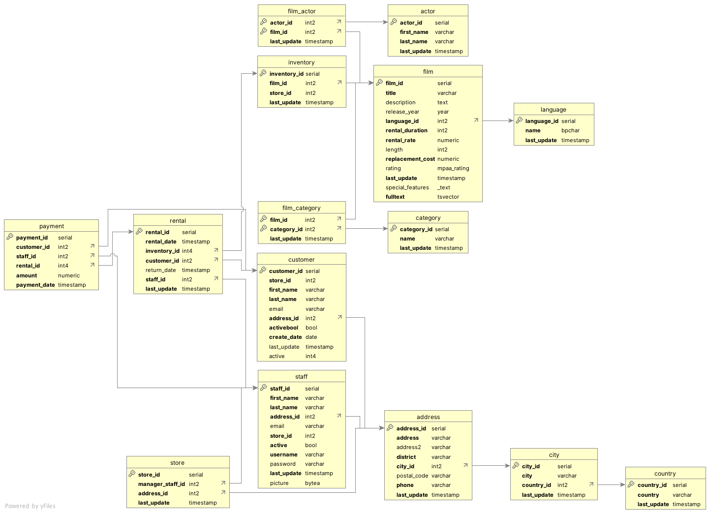
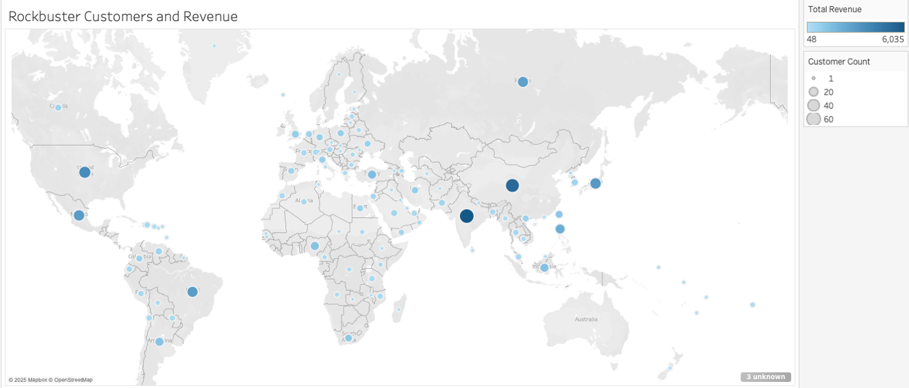
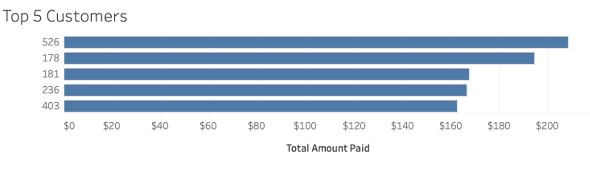

# Rockbuster Customer & Revenue Analysis

## Overview
Rockbuster Stealth is a global DVD rental company preparing for a transition to streaming. This project analyzes transactional rental data using PostgreSQL to identify revenue drivers, geographic demand patterns, and high-value customer segments. Results are summarized in SQL outputs and visualized in Tableau to support strategic decision-making.

This repository contains the full analytical workflow: schema review, query development, aggregated outputs, and presentation-ready visuals.

---

## Business Objectives
The analysis addresses the following questions:

- Which films generate the highest and lowest revenue?
- What is the average rental duration (catalog vs. realized)?
- Where are customers geographically concentrated?
- Which customers represent the highest lifetime value (LTV)?
- How does revenue vary by country and region?

---

## Data Model
The Rockbuster dataset includes customer, rental, payment, inventory, film, and geographic tables. Revenue attribution and customer geography are derived through structured joins across these entities.



---

## Methodology

**Revenue Definition**
Revenue is defined as `SUM(payment.amount)`. Film-level revenue is attributed through joins:
`payment → rental → inventory → film`.

**Customer Geography**
Customer location is derived via:
`customer → address → city → country`.

**High Lifetime Value Segment**
Customers are ranked by total lifetime revenue using window functions (NTILE) and segmented into deciles. The top decile represents the high-LTV segment.

All SQL queries are fully runnable and documented in `sql/analysis.sql`.

---

## Key Insights

### Global Customer Distribution
Revenue and customer counts are concentrated in a limited number of countries, with measurable variation in revenue per customer across regions.



### Revenue Concentration Among Customers
Revenue is unevenly distributed, with a small subset of customers contributing a disproportionate share of total payments.



### Film-Level Revenue Variation
Certain titles significantly outperform others in total rental revenue, indicating opportunities for targeted content strategy and promotional emphasis.

---

## Repository Structure

```
rockbuster-sql-analysis/
│
├── docs/
│   ├── rockbuster-data-dictionary.pdf
│   └── rockbuster-presentation.pdf
│
├── images/
│   ├── rockbuster-erd.png
│   ├── customer-geography-map.png
│   └── top5_customers.png
│
├── outputs/
│   └── rockbuster-sql-outputs.xlsx
│
├── sql/
│   ├── schema_notes.md
│   └── analysis.sql
│
└── README.md
```

---

## Deliverables

- **Presentation Deck (PDF):** `docs/rockbuster-presentation.pdf`
- **Data Dictionary (PDF):** `docs/rockbuster-data-dictionary.pdf`
- **SQL Analysis (runnable):** `sql/analysis.sql`
- **Schema Notes (joins + definitions):** `sql/schema_notes.md`
- **Aggregated Outputs (Excel):** `outputs/rockbuster-sql-outputs.xlsx`

---

## Tools & Techniques

- PostgreSQL
- Complex joins across normalized schemas
- Aggregations and grouping
- Common Table Expressions (CTEs)
- Window functions (NTILE, ranking)
- Data validation / QA checks
- Tableau (visualization)

---

## How to Reproduce the Analysis

1. Load the Rockbuster schema into PostgreSQL.
2. Review table relationships in `sql/schema_notes.md`.
3. Execute queries in `sql/analysis.sql` section by section.
4. Export result sets as CSV if needed for visualization.
5. Use the Tableau dashboard links below for interactive exploration (optional).

---

## Tableau Dashboards
- Customer Geography (Bubble Map): https://public.tableau.com/views/RockbusterBubbleMap_17658994601690/Sheet1?:showVizHome=no
- Top Customer Countries: https://public.tableau.com/views/RockbusterTop10Cities_17659038031120/Sheet1?:showVizHome=no
- High Value Customers: https://public.tableau.com/views/Top5CustomersRockbusterNew/Sheet1?:showVizHome=no

---

## Summary
This project demonstrates end-to-end analytical workflow: structured data modeling, revenue attribution logic, customer segmentation, and geographic analysis using SQL. The repository is organized to reflect professional analytical practice, with clear documentation, reproducible queries, and presentation-ready outputs.
