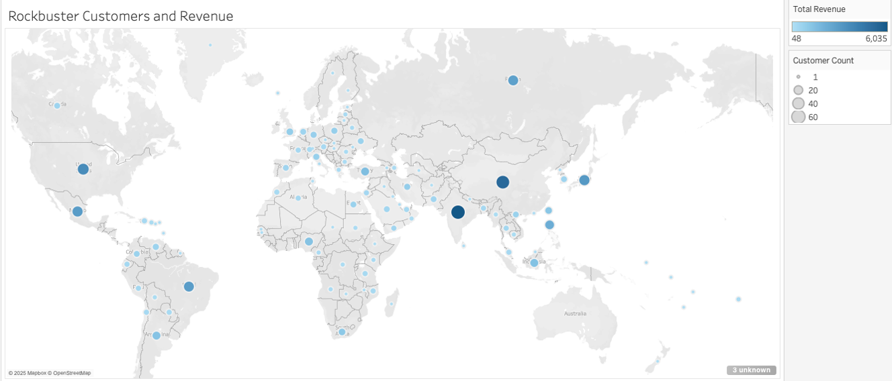
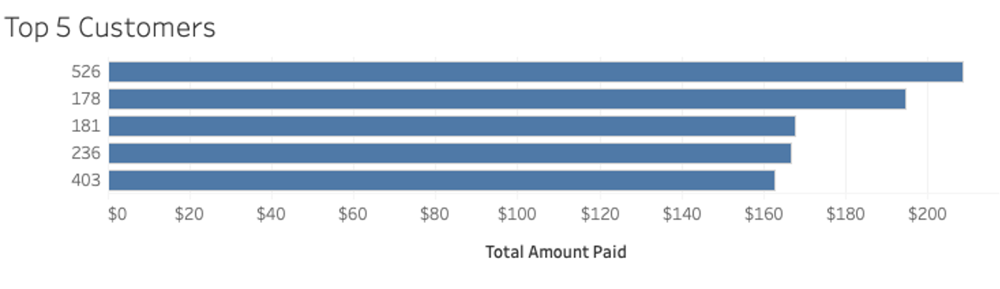
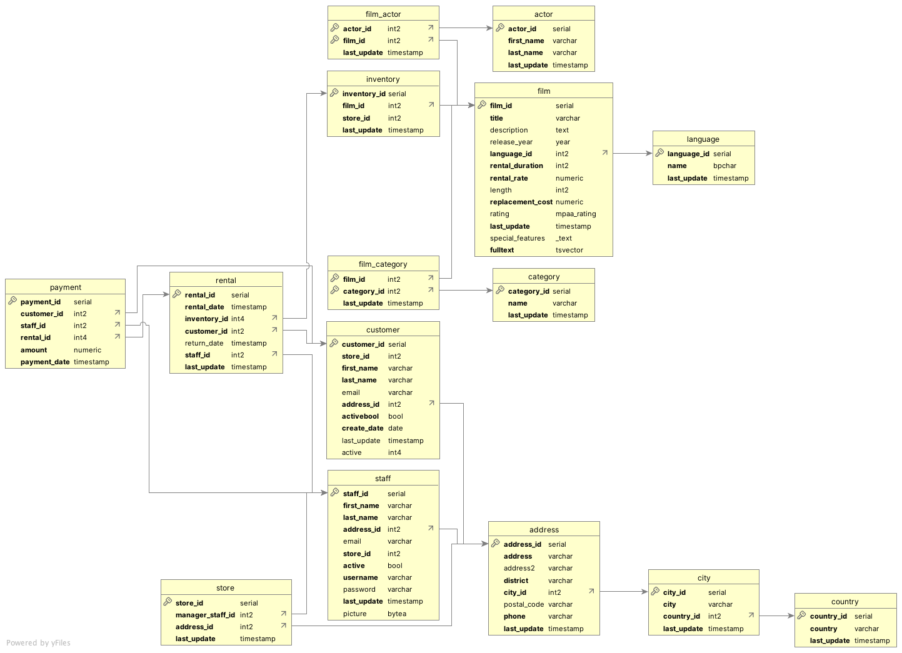

# Rockbuster Customer & Revenue Analysis

SQL-based analysis of customer behavior, revenue concentration, and geographic demand patterns for a global DVD rental company preparing for a transition to streaming.

---

## Executive Summary

Rockbuster Stealth is a global DVD rental company evaluating strategic decisions as it prepares for a shift toward streaming. This project uses **PostgreSQL** to analyze transactional rental data and answer key business questions around:

- revenue concentration
- customer lifetime value
- geographic demand patterns

The analysis demonstrates how normalized relational data can be transformed into actionable business insight using **joins, CTEs, aggregations, and window functions**.

### Key Takeaways

- Revenue is concentrated among a relatively small group of high-value customers.
- Customer demand is globally distributed but concentrated in a limited number of countries.
- A subset of films generates disproportionately high rental revenue.
- Geographic and customer segmentation can directly inform a targeted streaming rollout strategy.

---

## Visual Highlights

### Customer Geography (Revenue & Customer Distribution)



### Top Customers by Lifetime Value



---

## Business Problem

Rockbuster leadership needs visibility into **where revenue comes from**, **which customers drive value**, and **which markets matter most** as the company transitions to streaming.

This project evaluates:

- Which films generate the most revenue
- Where customers are geographically concentrated
- Which customers represent the highest lifetime value
- How revenue varies across regions

The goal is to move from raw transactional data to clear, decision-ready insight.

---

## Data Model

The dataset is a normalized relational schema consisting of:

- fact tables: `payment`, `rental`, `inventory`
- dimension tables: `customer`, `film`, `category`, `actor`, `language`, `store`, `address`, `city`, `country`
- bridge tables: `film_actor`, `film_category`



### Key Join Logic

**Revenue Attribution**

```
payment → rental → inventory → film
```

**Customer Geography**

```
customer → address → city → country
```

---

## Methodology

### 1. Schema Understanding

Reviewed relational structure to identify how transactions, customers, and products connect.

### 2. Revenue Definition

Defined revenue as:

```
SUM(payment.amount)
```

Ensured correct attribution by joining through rental and inventory tables.

### 3. Customer Segmentation

- Calculated total lifetime revenue per customer
- Used **window functions (NTILE)** to segment customers into value tiers
- Identified top decile as high-LTV segment

### 4. Geographic Analysis

- Joined customer records to geographic tables
- Analyzed customer and revenue distribution by country and city

### 5. Output & Visualization

- Generated SQL outputs for analysis
- Exported tables to Excel and Tableau for visualization

---

## Key Findings

### 1. Customer demand is geographically concentrated

Customers are globally distributed but heavily concentrated in a small number of countries.

**Implication:** Expansion or marketing efforts should prioritize high-density markets rather than treating demand as evenly distributed.

### 2. Revenue is concentrated among high-value customers

A relatively small subset of customers contributes a disproportionate share of total revenue.

**Implication:** Retention strategies targeting high-value customers would likely produce outsized impact.

### 3. Revenue varies across markets

Some regions generate more revenue per customer than others, indicating differences in customer value.

**Implication:** Market prioritization should consider both customer count and revenue per customer.

### 4. Film-level revenue is uneven

A subset of titles significantly outperforms the rest.

**Implication:** Content strategy should emphasize high-performing categories and titles.

---

## Why This Project Matters

This project demonstrates the ability to:

- work with normalized relational data
- define metrics correctly across multiple joins
- use SQL beyond basic queries (CTEs, window functions)
- segment customers and analyze revenue distribution
- translate SQL outputs into business insights

This mirrors real-world analytics work in product, operations, and business intelligence roles.

---

## Deliverables

- **SQL Analysis (runnable):** `sql/analysis.sql`
- **Schema Notes:** `sql/schema_notes.md`
- **Data Dictionary (PDF):** [`docs/rockbuster-data-dictionary.pdf`](docs/rockbuster-data-dictionary.pdf)
- **Presentation Deck (final deliverable):** [`docs/rockbuster-presentation.pdf`](docs/rockbuster-presentation.pdf)
- **Aggregated Outputs:** `outputs/rockbuster-sql-outputs.xlsx`

---

## Repository Structure

```text
rockbuster-sql-analysis/
├── docs/
│   ├── data-dictionary.md
│   ├── rockbuster-data-dictionary.pdf
│   └── rockbuster-presentation.pdf
├── images/
│   ├── rockbuster-erd.png
│   ├── customer-geography-map.png
│   └── top5_customers.png
├── outputs/
│   └── rockbuster-sql-outputs.xlsx
├── sql/
│   ├── schema_notes.md
│   └── analysis.sql
└── README.md
```

---

## How to Review This Project Quickly

1. Read the **Executive Summary**
2. Review the **Visual Highlights**
3. Skim the **Key Findings**
4. Open the **presentation deck** (final deliverable)
5. Review SQL queries for technical detail

---

## Tableau Dashboards

- Customer Geography: https://public.tableau.com/views/RockbusterBubbleMap_17658994601690/Sheet1?:showVizHome=no
- Top Customer Countries: https://public.tableau.com/views/RockbusterTop10Cities_17659038031120/Sheet1?:showVizHome=no
- High Value Customers: https://public.tableau.com/views/Top5CustomersRockbusterNew/Sheet1?:showVizHome=no

---

## Limitations

- Uses a structured sample dataset rather than production data
- Focuses on descriptive and segmentation analysis rather than predictive modeling
- Does not include behavioral features beyond transaction history

---

## Future Improvements

- Convert data dictionary into a markdown version for faster GitHub readability
- Add summary SQL script highlighting key queries only
- Build a unified Tableau dashboard combining all insights
- Extend segmentation beyond revenue (frequency, recency)

---

## Author

**Spencer Davis**
Data Analyst Portfolio Project
